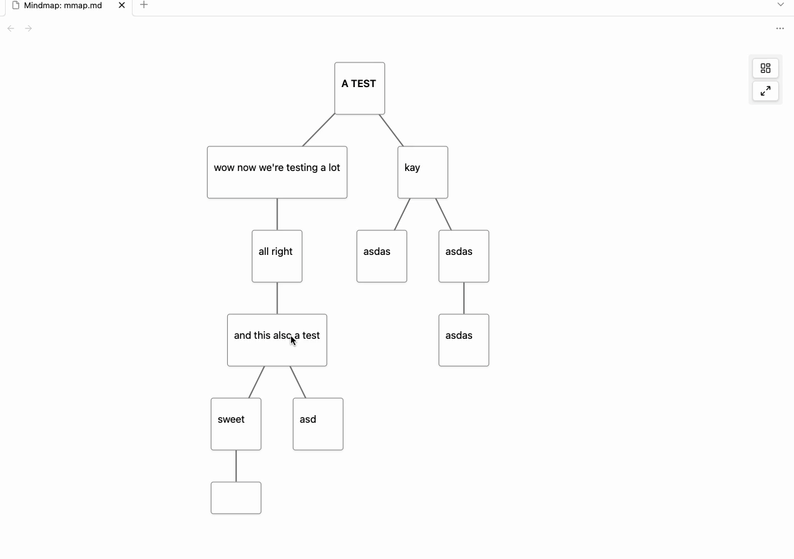

# Excerpt-Outline-Mindmap-Editor

An Obsidian plugin for creating visual mindmaps optimized for literature excerpting. Running on pure Markdown outlines, with a drag-and-drop workflow.

---

##  Development Notice

**Caution**: This plugin is in an early stage of development. Do not rely on it as your only method for managing important data. Bugs, data loss, and instability are still very possible.

**Developers**: I might not have the time to maintain this project permanently. If you are interested, leave me a message.

---

## What It Does

Excerpt-Outline-Mindmap-Editor lets you visually structure text excerpts as mindmaps using a  drag-and-drop system.

The underlying data model remains a standard Markdown outline (indented list) — fully compatible with Obsidian’s editor and outline plugins such as [Lineage](https://github.com/ycnmhd/obsidian-lineage).  
There is no proprietary format and no external storage, just Outline in Markdown (and a little bit of frontmatter).

---

## Key Features

- Drag-and-drop support for creating and editing hierarchical structures (each node represents a list item in a Markdown outline)
- Dragging a node into another creates a parent-child relationship. When dragging a node, all its children move with it. 
- Hover buttons allow adding new child and sibling nodes directly in the mindmap  
- Node deletion supports:
  - Removing a single node from its parent
  - Deleting a node along with all its children
- Undo/redo buttons let you – you guessed it – undo and redo actions (until you close a file).
- Layout options are specific to a file and are stored in frontmatter of the respective file.

---

## How to Use

1. Create a Markdown file: empty with an outline structure.
2. Open the file as a mindmap:
   - Click the three-dot menu in the top-right corner of the editor and select **"Open as mindmap"**,  
   - or right-click the file in the file explorer and choose **"Open as mindmap"**.
3. Use drag and drop to build or restructure your outline visually:
   - Drag a node onto another to make it a child
   - Beware: All children move with their parent
4. Use the "↓" button (visible on hover) to add child nodes directly
5. Use the "→" button (visible on hover) to add sibling nodes directly
6. Use the "x" button (also on hover) to delete a node, with the option to keep or remove children
7. Use the undo/redo buttons in the toolbar to reverse or replay actions
All changes are written to the file as a clean Markdown outline — no custom syntax or hidden metadata. You can open lineage files with this plugin and vice versa.

---

## Used Libraries

- [Cytoscape.js](https://js.cytoscape.org/) – for visual graph rendering  
- [Dagre](https://github.com/dagrejs/dagre) – for automatic hierarchical layout

Thanks to the developers.

---

## Inspiration

- [Lineage](https://github.com/ycnmhd/obsidian-lineage)
- [MarginNote](https://www.marginnote.com/)

---

## Roadmap

- copy+paste
- Keyboard navigation
- Embedding Mindmaps into Markdown
- Export and print options  

---

## Feedback and Contributions

Feedback, issues, and contributions are welcome.

---

## License

MIT License
