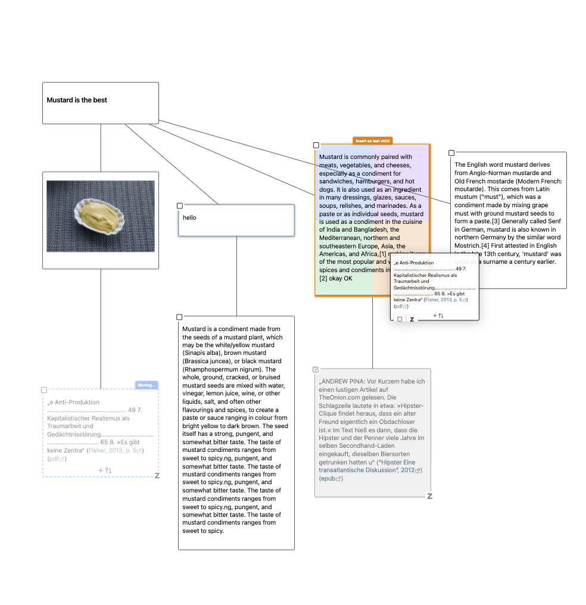
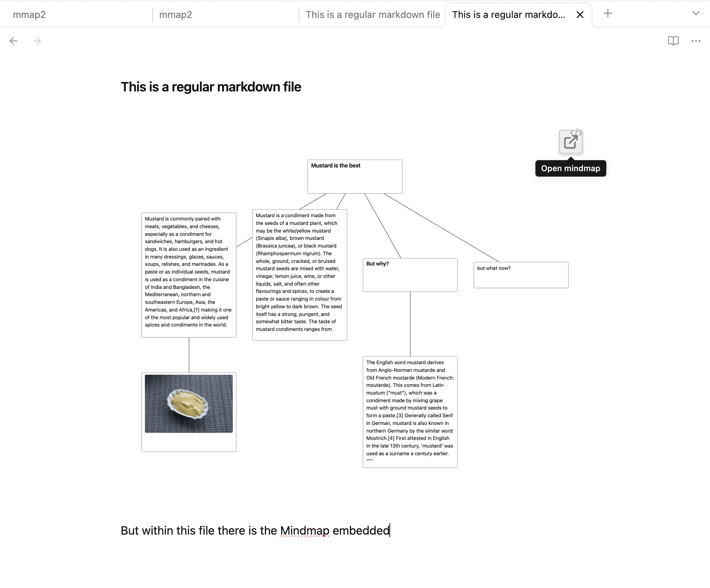

# Excerpt-Outline-Mindmap-Editor

**Beta warning:** This plugin is still in active development. Bugs, data loss, and instability are still possible.

Excerpt-Outline-Mindmap-Editor is an Obsidian plugin for working with Markdown outlines as visual mindmaps. It is built around a precise drag-and-drop workflow for restructuring hierarchical notes without leaving the underlying Markdown format.

It is especially useful for literature excerpting, research notes, and other situations where a plain outline is the right data model, but a spatial view makes the structure easier to understand and reshape.



---

## Core idea

A node in the mindmap is just a Markdown list item. Moving a node changes its position and indentation in the file. There is no custom database, no proprietary mindmap file, and no hidden document format.

This keeps your notes readable in Obsidian's normal editor and compatible with outline-based tools such as [Lineage](https://github.com/ycnmhd/obsidian-lineage).

---

## Drag and drop

The main interaction is dropping one node onto another. The target node is split into four drop zones:

- **Upper left:** insert as sibling before the target
- **Upper right:** insert as sibling after the target
- **Lower left:** insert as first child of the target
- **Lower right:** insert as last child of the target

When you move a node, its whole subtree moves with it. The result is written back to the Markdown outline, so the visual operation and the document structure stay in sync.

---

## Quick start

1. Create a Markdown file, either empty or with an outline.
2. Open the file as a mindmap:
   - Select the three-dot menu in the editor and choose **Open as mindmap**.
   - Or right-click the file in the file explorer and choose **Open as mindmap**.
3. Build or restructure the outline visually.

All changes are written back to the Markdown file. You can switch between the mindmap and the normal Markdown editor at any time.

---

## Markdown data

Mindmap files are regular Markdown files made from indented list items:

```markdown
- Parent node
	- Child node
		- Grandchild node
- Another parent node
```

Task list items are supported too:

```markdown
- [ ] Unchecked task
- [x] Checked task
```

If the file contains non-outline content outside list items, the mindmap view may reject it as incompatible. Display settings such as layout, zoom, node width, and keyboard navigation mode are stored per file in the `excerpt-outline-mindmap` frontmatter key.

---

## What you can do

### Structure

- Move nodes with the four-zone drag-and-drop system.
- Add child and sibling nodes from hover controls or the context menu.
- Copy, cut, paste, duplicate, and delete nodes.
- Select multiple nodes by clicking with **Cmd**/**Ctrl** or **Shift**, or by drawing a selection box on empty canvas space.
- Delete only a node or delete its full subtree when children are involved.

### Editing

- Double-click a node, press **Enter**, or use the context menu to edit.
- Newly created child and sibling nodes enter edit mode automatically.
- Markdown content renders inside nodes, including links, emphasis, images, SVGs, and other Obsidian-rendered content.
- Hard line breaks inside a single node are not supported and are removed from imported text.

### Tasks and sources

- Nodes using `- [ ]` and `- [x]` are recognized as tasks and can be toggled directly in the mindmap.
- Non-task nodes can optionally show a checkbox on hover and become task items when clicked.
- Checked nodes are visually muted.
- Nodes containing Zotero links show a Zotero badge for opening the source.

### Navigation

- Pan with two fingers on a trackpad or by holding the middle mouse button.
- Zoom with a trackpad pinch gesture or **Ctrl** + mouse wheel.
- Use **Fit to view** in the toolbar to refit the whole mindmap.
- Navigate selected nodes with the arrow keys.
- Choose spatial or hierarchical keyboard navigation in **General settings**.

### Toolbar

- **Undo** and **Redo**
- **Fit to view**
- Zoom menu
- Layout options
- Node width options
- General settings

### Keyboard shortcuts

- **Arrow keys** navigate through nodes.
- **Enter** edits the selected node.
- **Cmd/Ctrl + Arrow Down** adds a last child to the selected node.
- **Cmd/Ctrl + Arrow Left** adds a sibling before the selected node.
- **Cmd/Ctrl + Arrow Right** adds a sibling after the selected node.
- **Cmd/Ctrl + C** copies the selected node or selected nodes.
- **Cmd/Ctrl + X** cuts the selected node or selected nodes.
- **Cmd/Ctrl + V** pastes onto the currently selected node.
- **Delete**/**Backspace** deletes the selected node or selected nodes.

---

## Embed a mindmap in another note

Use a `mindmap-eome` code block with exactly one Markdown filename:

````markdown
```mindmap-eome
mindmap.md
```
````

The embedded mindmap is shown as a full read-only overview. Hover the top-right corner of the embed and select the icon to open that file in the regular editable mindmap view.

Only the filename belongs inside the code block. Options, extra text, and multiple files are not supported.



---

## Mobile support

The plugin offers mobile support. You can navigate, edit, and restructure your mindmaps using touch gestures. Double tap for a node context menu; stay long on a node to pick it up. Everything else works like on the desktop version.

---

## Libraries

- [Cytoscape.js](https://js.cytoscape.org/) for graph rendering
- [Dagre](https://github.com/dagrejs/dagre) for automatic hierarchical layout

Thanks to the developers.

---

## Inspiration

- [Lineage](https://github.com/ycnmhd/obsidian-lineage)
- [MarginNote](https://www.marginnote.com/)

---

## Roadmap

- Export and print options  

---

## Disclaimer

I vibecode my plugins—and the scope of this work exceeds my programming skills. Because of this, there is always a residual risk when using them. I do this primarily to bridge certain gaps in my own workflow. Should these plugins ever become obsolete because a professional developer used them as inspiration to code something truly solid and sophisticated, I would be absolutely thrilled.
