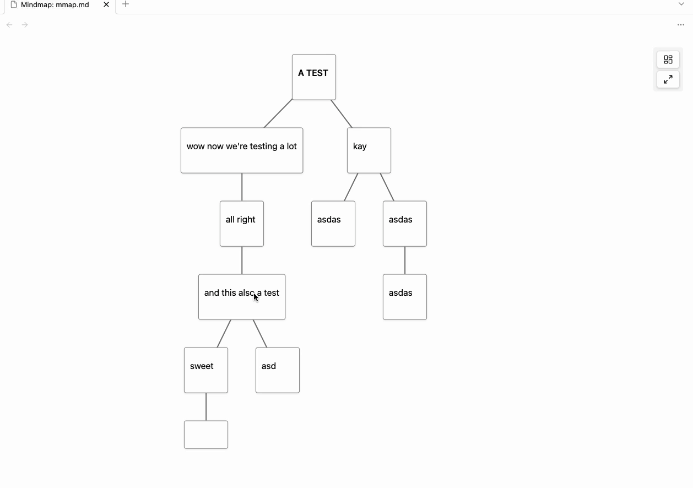

# Excerpt-Outline-Mindmap-Editor

BEWARE: STILL IN BETA! Bugs, data loss, and instability are still very possible.

An Obsidian plugin for creating visual mindmaps optimized for literature excerpting. Running on pure Markdown outlines, with a drag-and-drop workflow.

---

## What It Does

Excerpt-Outline-Mindmap-Editor lets you visually structure text excerpts as mindmaps using a  drag-and-drop system.

The underlying data model remains a standard Markdown outline (indented list) — fully compatible with Obsidian’s editor and outline plugins such as [Lineage](https://github.com/ycnmhd/obsidian-lineage).  
There is no proprietary format and no external storage.

---

## Key Features

- Drag-and-drop support for creating and editing hierarchical structures (Outline)
- Each node represents a list item with indentation in a Markdown outline  
- Dragging a node into another creates a parent-child relationship  
- When dragging a node, all its children move with it  
- Hover buttons allow adding new child and sibling nodes directly in the mindmap  
- Node deletion ask for:
  - Removing just the selected node, but keep its children
  - Deleting a node along with all its children
- undo/redo buttons
- layout options are stored in frontmatter of the respective file
- There is a Context Menu via Right Click
- Copy, Paste, Cut and Duplicate via Context Menu and Shortcuts
- Keyboard Navigation (Spatial and Hierarchical)
- you can select various nodes at once

---

## How to Use

1. Create a Markdown file: empty – or with an outline structure.
2. Open the file as a mindmap:
   - Click the three-dot menu in the top-right corner of the editor and select **"Open as mindmap"**,  
   - or right-click the file in the file explorer and choose **"Open as mindmap"**.
3. Use drag and drop to build or restructure your outline visually:

All changes are written to the file as a clean Markdown outline — no custom syntax or hidden metadata. You can open lineage files with this plugin and vice versa. Undo/redo history is preserved between sessions using frontmatter storage.

---

## Controls

### Navigate the canvas

- Use two fingers on the trackpad to move/pan across the mindmap.
- Use the trackpad pinch gesture to zoom in and out.
- Use the toolbar's fit-to-view button to refit the whole mindmap into the visible area.
- Mouse-dragging empty canvas space is reserved for box selection, not canvas movement.

### Select nodes

- Click a node to select it.
- Hold **Cmd**/**Ctrl** or **Shift** while clicking nodes to add multiple nodes to the selection.
- Drag with the left mouse button on empty canvas space to draw a selection box.
- Hold **Shift** while drawing a selection box to add nodes to the current selection.
- Click empty canvas space to clear the current selection.

### Edit and create nodes

- Double-click a node to edit it.
- Right-click a node and choose **Edit node** to edit it from the context menu.
- Use the hover controls or the context menu to choose **Add child** or **Add sibling**.
- Newly created child or sibling nodes enter edit mode automatically so you can start typing right away.

### Move and restructure nodes

- Drag a node onto another node to make it a child of the target node.
- Moving a node also moves its children.
- Use **Cut** and **Paste** to move nodes by clipboard-style interaction:
  - **Cut** marks the selected nodes as pending and fades them visually.
  - The original nodes are removed only when you paste them somewhere else.
  - Pasting onto a target node inserts the cut nodes as children of that target.

### Context menu and clipboard

Right-click a node to open the context menu. Available actions include:

- **Add child**
- **Add sibling**
- **Edit node**
- **Copy**
- **Cut**
- **Paste**
- **Duplicate**
- **Delete**

**Copy**, **Cut**, and **Delete** work with multiple selected nodes. The context menu shows the number of affected nodes when multiple nodes are selected.

### Keyboard shortcuts

- **Arrow keys** navigate through nodes.
- The currently selected node is centered automatically while navigating with the arrow keys.
- **Cmd/Ctrl + C** copies the selected node or selected nodes.
- **Cmd/Ctrl + X** cuts the selected node or selected nodes.
- **Cmd/Ctrl + V** pastes onto the currently selected node.
- **Delete**/**Backspace** deletes the selected node or selected nodes.

When deleting nodes that have unselected children, the plugin asks whether to delete the full subtree or only the selected/current node while keeping its children.

---

## Used Libraries

- [Cytoscape.js](https://js.cytoscape.org/) – for visual graph rendering  
- [Dagre](https://github.com/dagrejs/dagre) – for automatic hierarchical layout

Thanks to the developers.

---

## Inspiration

- [Lineage](https://github.com/ycnmhd/obsidian-lineage)
- [MarginNote](https://www.marginnote.com/)

---

## Roadmap

- Embedding Mindmaps into Markdown
- Export and print options  

---

## Disclaimer

I vibecode my plugins—and the scope of this work exceeds my programming skills. Because of this, there is always a residual risk when using them. I do this primarily to bridge certain gaps in my own workflow. Should these plugins ever become obsolete because a professional developer used them as inspiration to code something truly solid and sophisticated, I would be absolutely thrilled.
